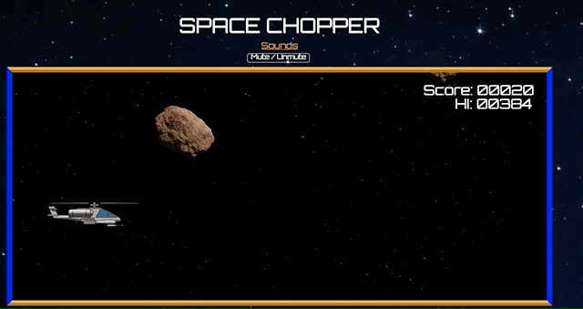

## Space Chopper

[Live Link!](https://sheriffhoodie.github.io/space-chopper/)

### Background

Space Chopper is a 2D side-scrolling spinoff version of the classic Helicopter arcade game for 1 Player involving keeping a constantly falling helicopter hovering and dodging oncoming obstacles that appear randomly. The player simply uses the "F" key to engage the flight: pressing and holding down will cause the helicopter to steadily ascend while lightly tapping at regular intervals will keep it hovering at the same altitude and letting it go will cause the helicopter to lose altitude.

There is no "end" to the game, your distance is tracked as you fly forward and is given to you as your score when you crash the chopper into an obstacle or the top or bottom edges of the screen.

### Functionality

In the game, users can:

* start, pause, and reset the game screen
* fully control the altitude of the helicopter as described above and guide it through the maze of floating obstacles
* see their distance score updating in real time, and presented to them at the end
* view the high score, stored locally
* enjoy sound effects and background music during the menu and gameplay with a mute button option

### Architecture and Technologies

The game uses vanilla Javascript with HTML, CSS, and HTML Canvas for rendering with HTML5 Audio for sound effects and background music interface and playback. The main entry file holds all gameplay logic, leaving the canvas structure and styling to separate HTML and CSS files.

### Future Directions

* Save global high scores to a database with a username, display top 5 high scores before game start and after game end
* Create different difficulty modes (easy and hard) that the user can choose from before play
* Create playlist of shorter tracks that rotate through automatically
* Add moving/rotating sprites for asteroids and additional types of obstacles
* In future refactoring, the Howler audio library will be used for audio playback and manipulation

### Credits

* Music: 'Heliscope' by Jesse James
       'OuterSpace HipHop Beat' by Cyrov Instrumental
* Explosion Sound Effect: https://opengameart.org/content/big-explosion
* Explosion Sprite: https://opengameart.org/content/explosion
